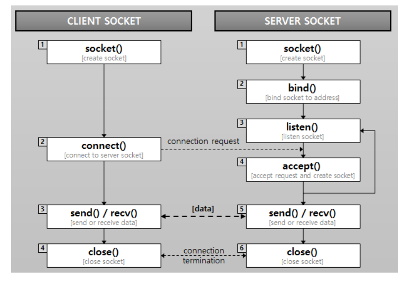

# 웹 애플리케이션 이해
## 진행 사항
1. 사용자 요청을 메인 스레드가 처리하도록 한다.
2. 사용자 요청이 들어올 때마다 스레드를 새로 생성해서 사용자 요청을 처리하도록 한다.
3. 스레드 풀을 적용해 안정적인 서비스가 가능하도록 한다.

## 개념
### HTTP 프로토콜
* 서버와 클라이언트가 웹에서 데이터를 주고받기 위한 프로토콜(규약)
  * 웹 상에서 불특정 다수와 연결하도록 하는 프로토콜
  * 따라서 더 많이 연결할 수 있도록 무상태, 비연결성이라는 특징을 가지고 있다.
  * 2xx(성공), 3xx(리다이렉션), 4xx(클라이언트 에러), 5xx(서버 에러) 등
* 요청,응답 메세지 구조 (Request Line, Heade, Blank line, Body)
* 클라이언트 - 서버 모델
* 무상태 프로토콜
  * 서버가 클라이언트 상태를 유지하지 않음 (응답주고 연결 끊어버림)
  * Keep-Alive 해서 일정 시간동안 어느 정도 연결시켜둠
  * 잘못 사용하면 성능 하락돼버림 (스레드 부족)
* 비연결성
  * 쿠키(클라이언트에 정보 저장), 세션(서버에 정보 저장), JWT
  
### 소켓

### HTTPRequest
* RequestLine (GET /calculate?operand=11&operator=*&operand2=55
  )
  * HttpMethod
  * path
  * queryString
* Header
* Body